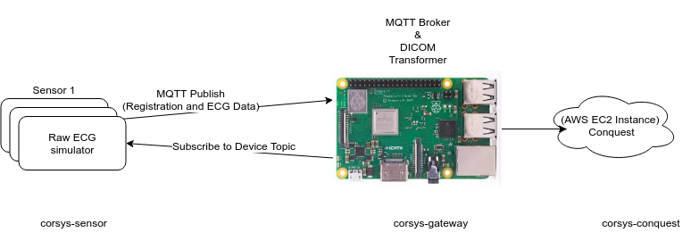

# Corsys

This project is comprised of 3 sub-projects. As shown in the architecture below, each sub project corresponds to each folder in this repository. One has to make sure that the sensor and the gateway be in the same network or the gateway should at least be reachable by the sensor.

